<h1 align="center">Multi-Robot Academy Guide</h1>
<h3 align="center">실시간 상담 예약 및 멀티 로봇 안내 시스템</h3>

<p align="center">
  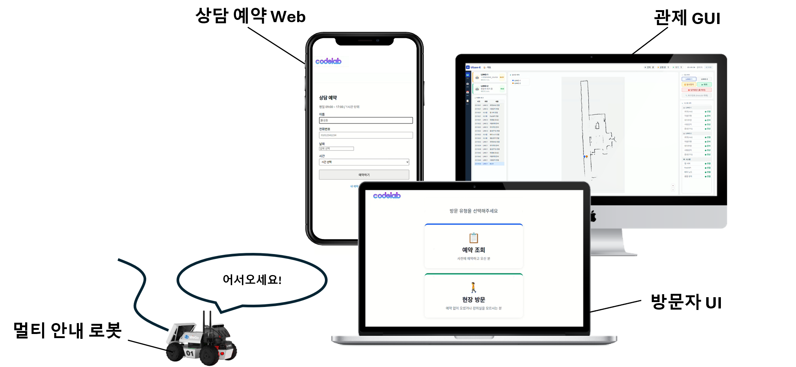
</p>

>_상담 예약 Web 으로 상담을 예약하고, 방문자 UI 를 통해 예약을 확인하면 음성과 함께 멀티 안내 로봇이 목적지까지 안내._

## Table of Contents

1. [프로젝트 소개](#1-프로젝트-소개)
2. [기능 명세](#2-기능-명세)
3. [프로젝트 설계](#3-프로젝트-설계)
4. [기능 설명](#4-기능-설명)
5. [실행 방법](#5-실행-방법)
6. [시연 영상](#6-시연-영상)

---

## 1. 프로젝트 소개

학원을 방문하는 사람을 관계자가 일일이 안내하지 않아도 되도록 하고, 상담 일정 관리부터 목적지 안내·복귀 후 재임무 수행까지 전 과정을 자동화. 로봇 2대가 동시에 운영되며, 서로 마주쳐도 우선순위에 따라 양보하고, 사람이 감지되면 멈췄다가 다시 출발.

- **운영 시나리오**: 예약Web(상담 예약) → 방문자 UI(예약 조회 / 현장 접수) → 임무 생성 → 대기 중인 로봇 자동 배정 → 음성 안내와 함께 목적지 주행 → 상담실 도착 및 음성 안내 → 홈 정밀 제어 복귀 → 임무 대기
- **핵심 도전 과제**: ① 유리문(라이다 난반사) 구간에서의 안정적 자율주행 ② 2대 로봇의 우선순위 기반 협조 주행 ③ 사람 감지·상대 로봇과 교착·관제 긴급 제어를 통합한 실시간 주행 정지(Nav2 BT 게이트) ④ 마커 기반 정밀 복귀 및 위치추정(AMCL) 오차 초기화 ⑤ 방문자·관제·로봇을 잇는 분산 시스템 통신

### 기술 스택

| 분류 | 기술 |
|------|------|
| **Language** |    |
| **Robotics / Navigation** |    |
| **Vision AI** |   |
| **Backend** |      |
| **Frontend** |   |
| **Hardware** |     |

### Tool & Platforms

| 도구 | 용도 |
|------|------|
|  | 일정 및 개발 현황 관리 (이슈 · 스프린트 · 에픽) |
|  | 기술 문서 · 의사결정 기록 관리 |
|  | 소스 버전 관리 · 협업 |
|  | 시스템 설계 · 화면 설계 · 플로우차트 다이어그램 |

### H/W

| 구성 | 사양 | 용도 |
|------|------|------|
| 로봇 플랫폼 | AgileX LIMO ×2 |
| 온보드 컴퓨터 | NVIDIA Jetson Orin NX |
| 2D LiDAR | YDLIDAR T-mini Plus (USB-UART) |
| RGB-D 카메라 | Orbbec Dabai DC1 | 

---

## 2. 기능 명세

| 기능 | 설명 | 관련 패키지 |
|------|------|------------|
| 상태 관리 (FSM) | 로봇 임무를 5개 상태(IDLE·GUIDING·RETURNING·WAITING·FAILED)로 정의하고 상태별 행동·전이를 규정 → 멀티 로봇을 일관된 규칙으로 효율적인 제어 | `ulsan_behaviour` |
| 자율주행 | Cartographer 지도 작성 + Nav2·AMCL 위치추정·경로계획, NavigateThroughPosesNavigator Plugin 활용 위험 구간 주행시 안전한 경유지 통과 | `ulsan_bringup`, `ulsan_2d_nav` |
| 멀티로봇 충돌 회피 | 우선순위 기반 양보(GUIDING > RETURNING, 동순위 LIMO 1), 거리 감지 pause/resume | `ulsan_traffic`, `ulsan_behaviour` |
| 사람 감지 정지 | YOLOv8 + Depth 게이팅으로 근거리 사람 감지 시 즉시 정지, 이탈 시 재개 | `ulsan_person_detect` |
| 통합 정지 게이트 | 사람·관제·트래픽 3종 정지 요인을 단일 신호(`/motion_hold`)로 통합 및 Behavior Tree 활용 주행| `ulsan_bt_plugins`, `ulsan_behaviour` |
| 정밀 홈 복귀 | ArUco 마커 기반 PBVS 단계형 제어로 ~1cm 정밀 정차 후 AMCL 위치 리셋 | `ulsan_aruco` |
| 음성 안내 | edge-tts 기반 출발·도착·실패 안내, 출발은 발화-후-주행 동기화 | `ulsan_voice` |
| 예약 | 예약 Web(사전 상담 예약) · 방문자 UI(현장 접수/예약 조회) · FastAPI 예약 백엔드(MySQL — 예약 CRUD·일정 관리) | `ulsan_reservation`, `ulsan-web-ui`, `ulsan-visitor-ui` |
| 임무 할당 | 예약·현장 접수를 임무로 생성 → 대기 중(IDLE) 로봇에 자동 배정 | `ulsan_dispatcher` |
| 관제 GUI | 지도·로봇 실시간 위치·긴급 제어·이벤트/미션 로그·시스템 상태 대시보드 | `ulsan_gui` |


### 관제 GUI

PyQt5 멀티로봇 대시보드. 지도·두 로봇 실시간 위치/상태·실시간 카메라·긴급 수동 제어·예약 내역·이벤트 로그를 한 화면에서 관제. 로봇 상태는 `diagnostics` 기반으로 표시해 연결 끊김까지 감지.

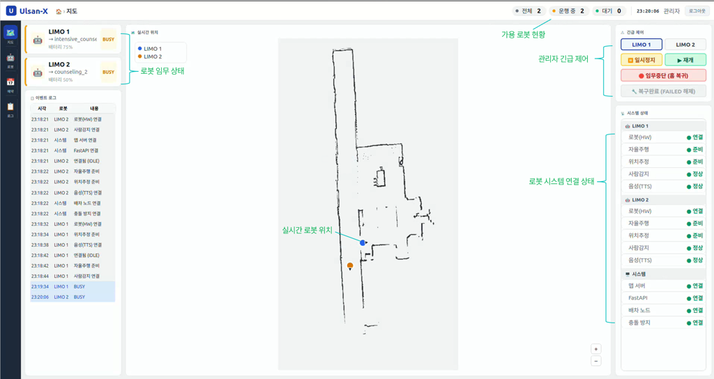

> _운영 — 지도 · 두 로봇 실시간 위치/상태 · 시스템 연결 상태_

<table>
  <tr>
    <td width="33%">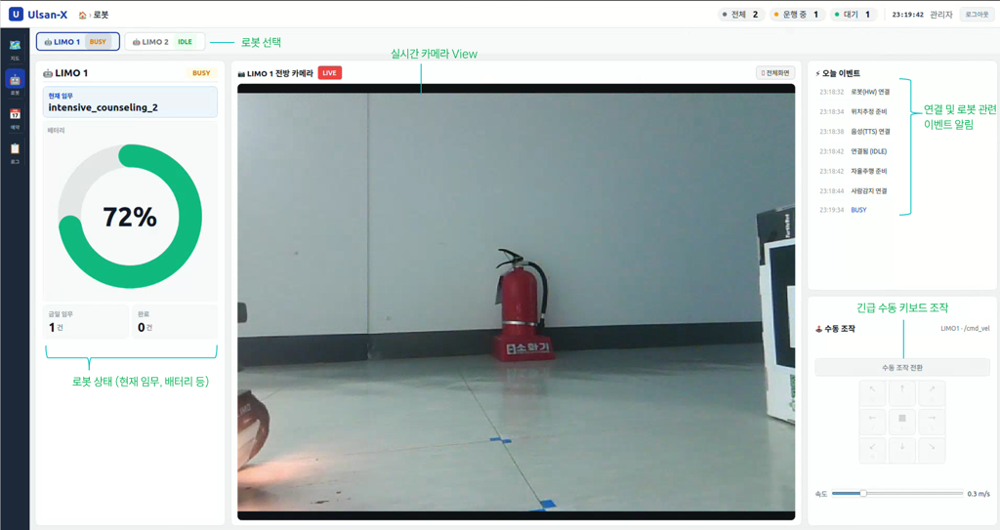</td>
    <td width="33%">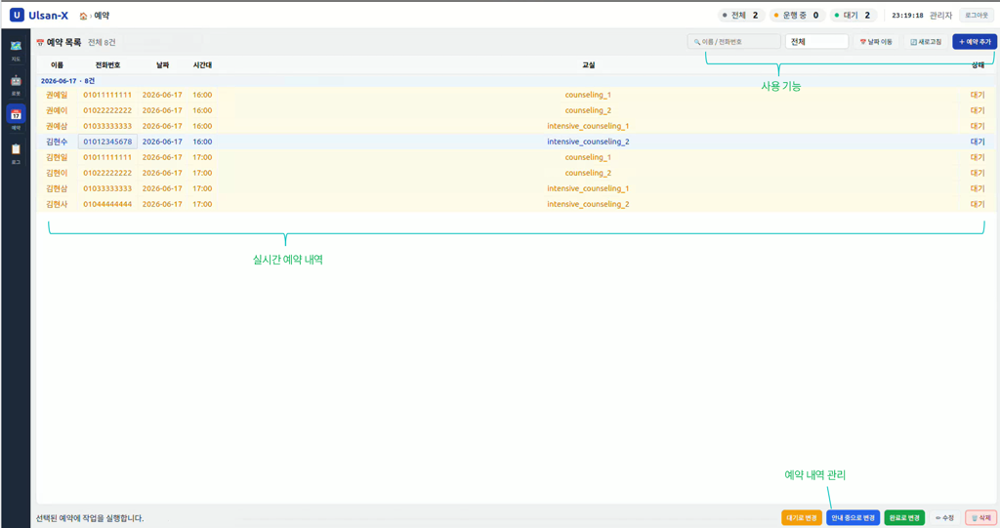</td>
    <td width="33%">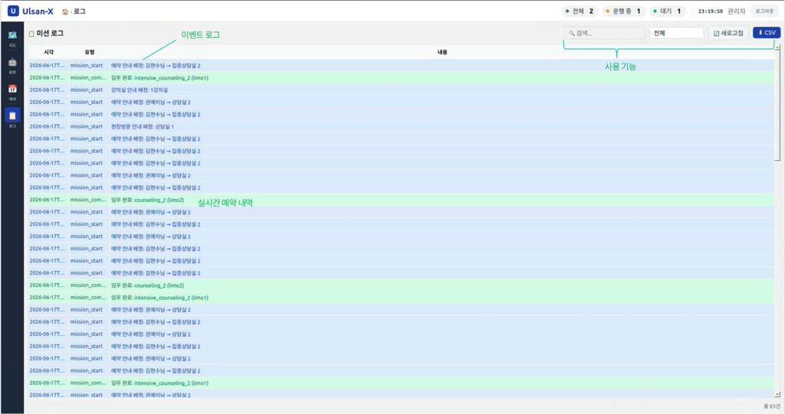</td>
  </tr>
  <tr>
    <td align="center"><em>로봇 카드 · 실시간 카메라 · 긴급 수동 조작</em></td>
    <td align="center"><em>실시간 예약 내역 관리</em></td>
    <td align="center"><em>이벤트 · 미션 로그</em></td>
  </tr>
</table>


### 예약 Web

방문자가 휴대폰·PC로 상담을 사전 예약하는 React 웹(`ulsan-web-ui`). 예약 가능 시간대를 실시간 조회해 **마감된 슬롯은 비활성화**하고, 예약 완료 시 예약 정보를 표시.

<table>
  <tr>
    <td width="50%">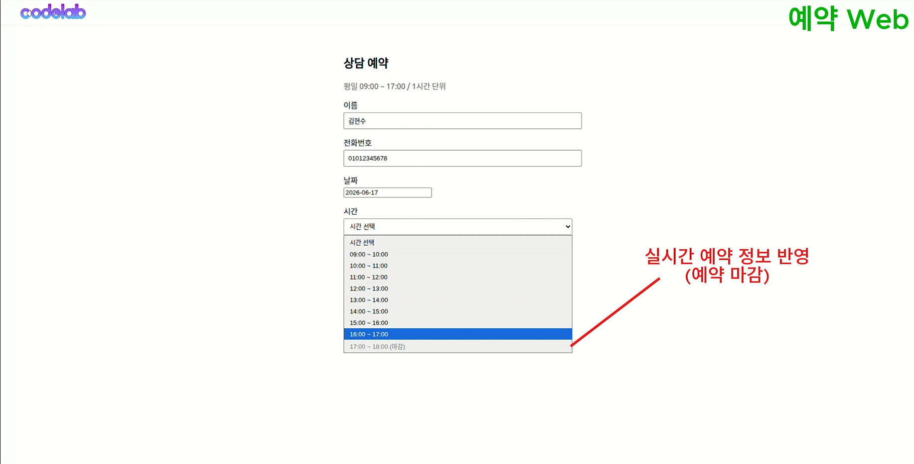</td>
    <td width="50%">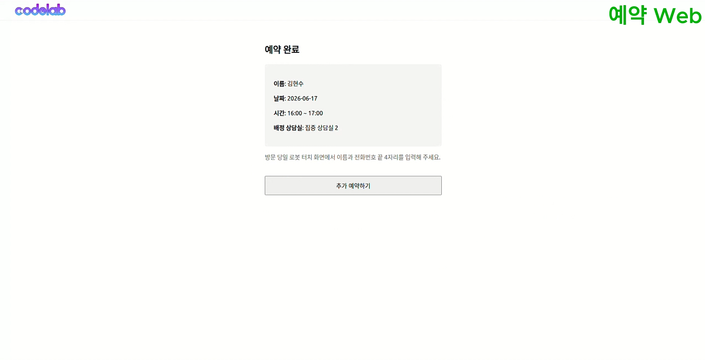</td>
  </tr>
  <tr>
    <td align="center"><em>상담 예약 — 실시간 잔여 시간대 반영(마감 비활성)</em></td>
    <td align="center"><em>예약 완료 — 배정 상담실 안내</em></td>
  </tr>
</table>


### 방문자 UI

학원 입구 키오스크/노트북에서 방문자가 접수하는 React 화면(`ulsan-visitor-ui`). **예약 조회**(이름 + 전화 끝 4자리)와 **현장 방문**(예약 없이 방문 / 강의실 안내) 두 흐름을 제공, 접수가 끝나면 대기 중인 로봇에 임무가 배정. 모든 로봇이 안내 중이면 대기 안내 화면을 표시.

<table>
  <tr>
    <td width="33%">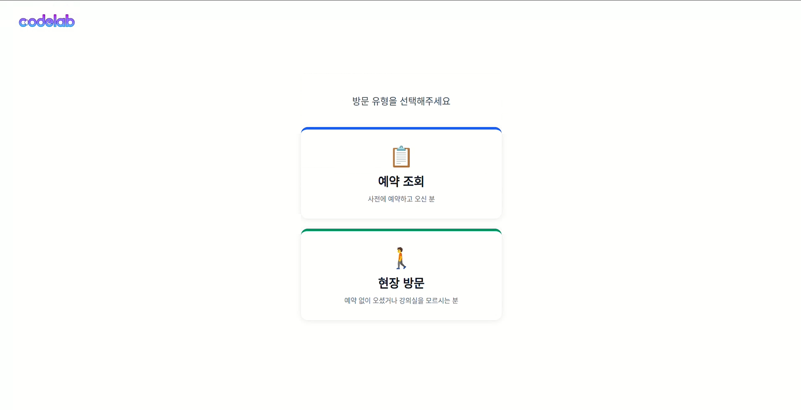</td>
    <td width="33%">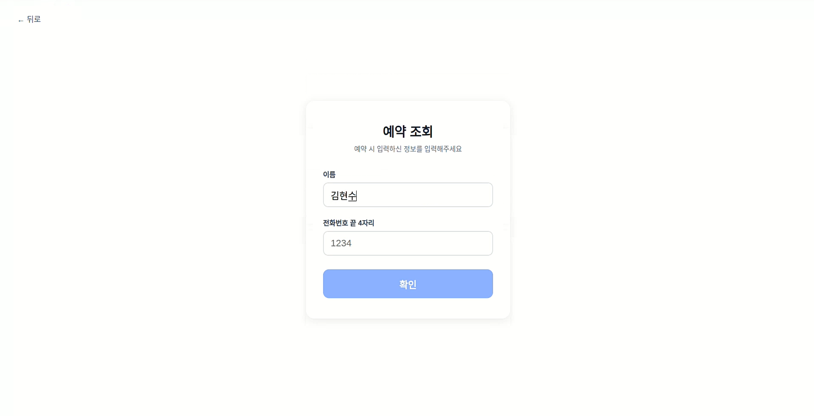</td>
    <td width="33%">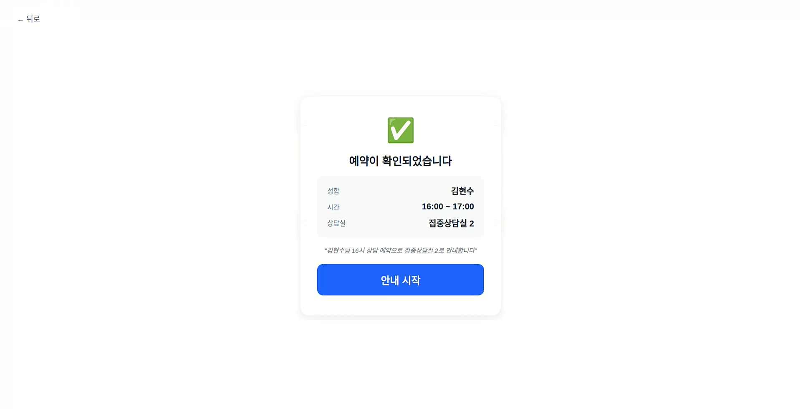</td>
  </tr>
  <tr>
    <td align="center"><em>방문 유형 선택(예약 조회 / 현장 방문)</em></td>
    <td align="center"><em>예약 조회 — 이름 · 전화 끝 4자리</em></td>
    <td align="center"><em>예약 확인 → 안내 시작</em></td>
  </tr>
  <tr>
    <td width="33%">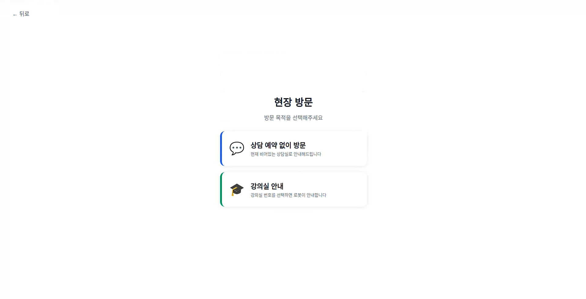</td>
    <td width="33%">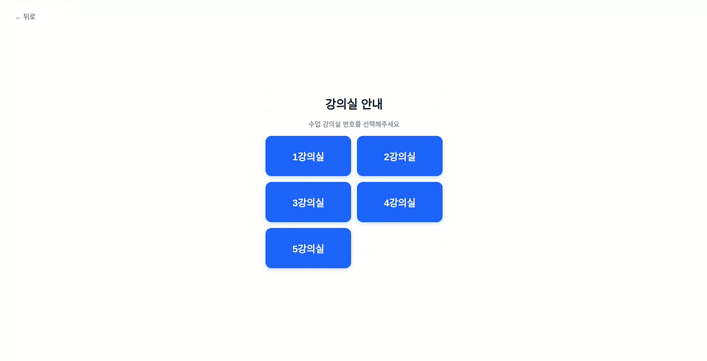</td>
    <td width="33%">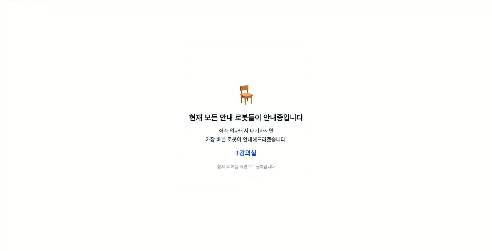</td>
  </tr>
  <tr>
    <td align="center"><em>현장 방문 — 상담 / 강의실 안내 선택</em></td>
    <td align="center"><em>강의실 선택(1~5강의실)</em></td>
    <td align="center"><em>모든 로봇 사용 중 — 대기 안내</em></td>
  </tr>
</table>


### ERD

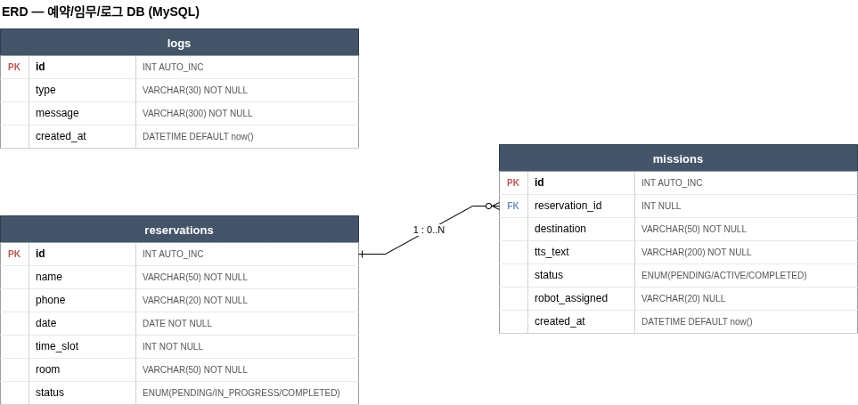

> _MySQL — `reservations`(예약) 1 : 0..N `missions`(임무), `logs`(이벤트). 예약 확정·현장 접수 시 `mission`을 생성, 디스패처가 IDLE 로봇에 배정._

---

## 3. 프로젝트 설계

### 3.1 시스템 아키텍처

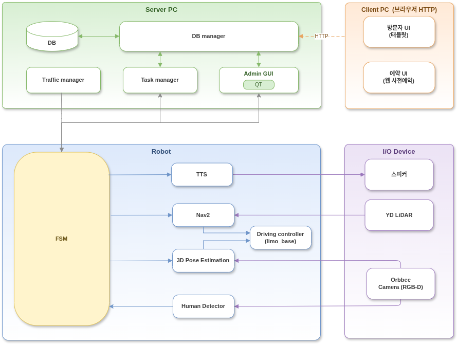

> _Server PC ⇄ Robot ⇄ I/O Device 구조_

### 3.2 데이터 흐름도

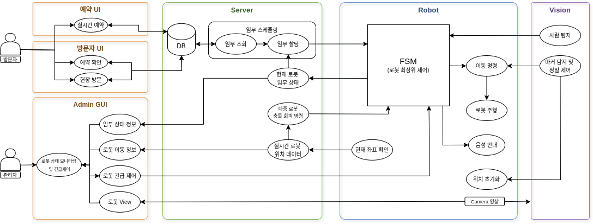

> _데이터 흐름 — 예약/방문자 UI → Server(임무 스케줄링 · DB) → Robot(FSM) ⇄ Vision(사람·마커 감지), 관제 GUI는 상태 모니터링·긴급 제어_

### 3.3 다중 로봇 네트워크 구성

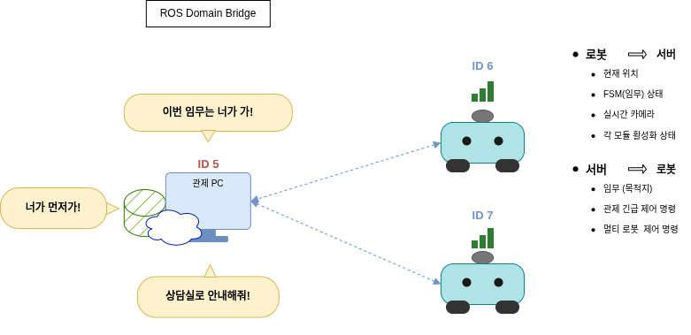

> _ROS Domain Bridge — 관제 PC(ID 5)가 두 로봇(ID 6/7)과 상태·명령 토픽만 선택적으로 교환_

### 3.4 패키지 구성

```
ulsan_ws/src/
├── ulsan_bringup/       # LIMO 드라이버 + 런치(teleop/cartographer/navigation_diff)
├── ulsan_2d_nav/        # Nav2 스택 + 커스텀 BT + 맵
├── limo_msgs/           # 도메인 브릿지용 메시지(LimoStatus, GuideGoal, Speak.srv)
├── ulsan_behaviour/     # Yasmin FSM (IDLE/GUIDING/RETURNING/WAITING/FAILED)
├── ulsan_aruco/         # ArUco PBVS 홈 도킹 (로봇 실행)
├── ulsan_person_detect/ # YOLOv8 사람 감지 (로봇 실행)
├── ulsan_bt_plugins/    # Nav2 BT C++ 플러그인 (MotionHoldCondition)
├── ulsan_voice/         # TTS (edge-tts, 로봇 실행)
├── ulsan_traffic/       # 멀티로봇 우선순위 pause/resume
├── ulsan_dispatcher/    # 예약 폴링 → 임무 배정
├── ulsan_bridge/        # 도메인 브릿지
├── ulsan_gui/           # PyQt 관제 GUI
└── ulsan_ui/            # RViz 맵 모니터링(보조)

ulsan_ui/                # ROS 외부
├── ulsan_reservation/   # FastAPI + MySQL 예약 백엔드
├── ulsan-web-ui/        # React 예약 웹 UI
└── ulsan-visitor-ui/    # React 방문자 UI
```

---

## 4. 기능 설명

### 로봇 상태 관리 (FSM)

로봇의 최상위 제어는 **Yasmin 기반 계층형 FSM**으로, 모든 임무 흐름을 5개 상태로 관리. 주행 중 정지 요인(사람·관제·트래픽)은 `WAITING`으로, 모든 주행/도킹 실패는 `FAILED`로 통합되어 관리자에게 손쉬운 시스템 복구 기능을 제공.

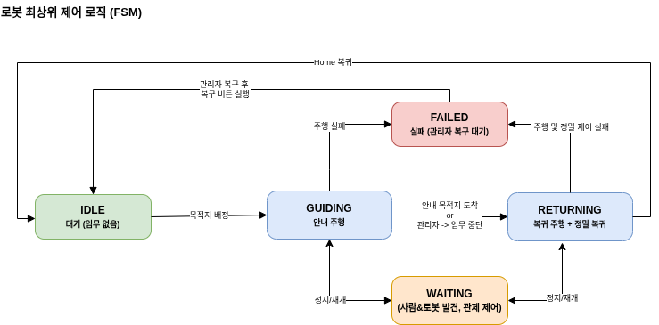

> _IDLE → GUIDING → RETURNING 순환, WAITING(정지/재개) · FAILED(실패→관리자 복구) 분기_

---

### 멀티로봇 우선순위 충돌 회피

두 로봇이 일정 거리 내로 접근하면 우선순위를 판정(GUIDING > RETURNING, 동순위 시 LIMO 1)해 낮은 쪽을 일시정지. 동적 costmap 회피가 아닌 **상태 기반 양보**로 두 로봇의 거리가 근접할 때에도 한 대가 확실히 멈춰 충돌이 구조적으로 발생하지 않음.

---

### 사람 감지 정지

YOLOv8(COCO 사전학습) + Depth 게이팅으로 주행 경로 위 **근거리 사람을 감지하면 즉시 정지**, 사람이 비키면 주행을 재개한다. Depth로 약 1.0m 안쪽만 트리거해 원거리 보행자에는 반응하지 않으며, clear-hold 디바운스로 정지/재개 떨림을 제거한다. 감지 결과는 아래 통합 정지 게이트로 전달.

---

### 통합 정지 게이트 (motion_hold)

사람 감지 · 관제 일시정지 · 멀티 로봇 충돌 방지 3종을 행동 FSM Waiting 상태에서 단일 신호(`/motion_hold`)로 표준화하고, 커스텀 Nav2 BT 노드 `MotionHoldCondition`이 이를 받아 주행을 정지. **Nav2 목표를 취소하지 않고 멈추므로**, 정지 요인이 사라지면 즉시 재개.

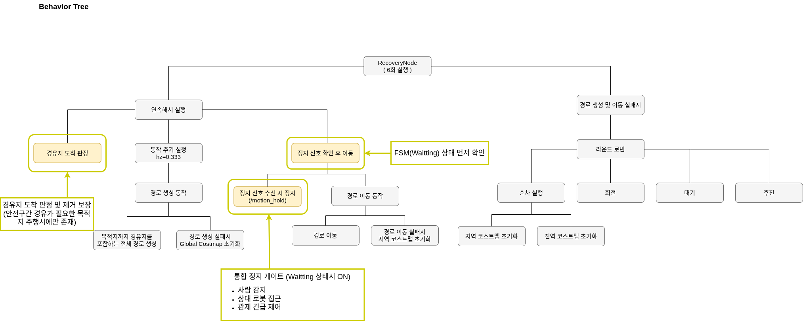

> _`정지 신호 확인 후 이동` 게이트가 WAITING 상태 시 주행을 halt — 사람·상대 로봇·관제 긴급 제어 통합_

---

### 정밀 홈 복귀 (ArUco PBVS)

홈 복귀 시 ArUco 마커 기반 **PBVS(Position-Based Visual Servoing)**로 정밀 정차한 뒤 AMCL 위치를 리셋. Nav2가 staging까지 대략 이동하고, staging→Home 구간은 마커를 보며 **staged 3단계 제어(조준→직진→정렬)**로 ~1cm 정밀 정차.

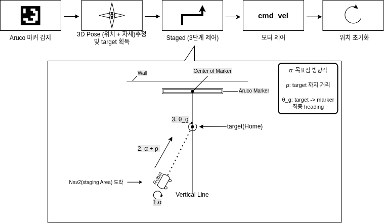

> _마커 감지 → solvePnP 3D 포즈/목표점(ρ·α·θ_g) → ①조준(α) → ②직진(ρ) → ③정렬(θ_g) → cmd_vel → AMCL 리셋_

- 마커 3D 포즈를 복원해 목표점 기하(ρ·α·θ_g)로 변환, 위치(직진)·자세(회전)를 단계 분리 제어
- 정차 후 home 좌표 `/initialpose` 발행 → AMCL drift 리셋 (시작 위치 초기화)

---

## 5. 실행 방법

### 5.1 필수 설치 패키지

> 자율주행·SLAM·센서퓨전 등 **알고리즘 본체는 검증된 표준 패키지를 사용**하고, 튜닝·통합·응용 로직만 직접 구현했다. 아래는 의존 패키지와 **설치 이유**.

**ROS 2 Humble — 자율주행·미들웨어**

| 패키지 | 왜 필요한가 |
|--------|------------|
| `navigation2` (nav2-*) | Nav2 자율주행 스택 — 경로계획·제어·**AMCL 위치추정**·BT 내비게이터 |
| `cartographer-ros` | 2D LiDAR **SLAM** — 운영 맵 제작 |
| `robot-localization` | **EKF 센서퓨전** — 휠 오도메트리 + IMU 융합으로 `odom→base_link` 생성 |
| `domain-bridge` | 도메인(5/6/7) 분리된 **멀티로봇 간 토픽 브릿지** |
| `yasmin` / `yasmin-ros` | 로봇 행동 **FSM**(IDLE/GUIDING/RETURNING/WAITING/FAILED) |
| `cv-bridge` | ROS 이미지 ↔ OpenCV 변환 (ArUco·사람감지) |

**Python — 인지·음성·GUI**

| 패키지 | 왜 필요한가 |
|--------|------------|
| `ultralytics` (YOLOv8) | **사람 감지** |
| `opencv-python` (cv2) | **ArUco 마커 검출 + solvePnP 포즈 복원**(PBVS 홈 도킹) |
| `edge-tts` | 텍스트→음성(**TTS**) 생성 |
| `PyQt5` | **관제 GUI** 대시보드 |

**시스템 (apt, 비-ROS)**

| 패키지 | 왜 필요한가 |
|--------|------------|
| `mpg123` + `pulseaudio` | TTS mp3 **재생** (로봇 내장 HDMI 스피커, pulse 싱크 고정) |
| `mysql-server` | 예약 데이터 저장 DB |

**예약 백엔드 (Python · FastAPI)**

| 패키지 | 왜 필요한가 |
|--------|------------|
| `fastapi` + `uvicorn` | 예약 **REST API 서버** |
| `sqlalchemy` + `pymysql` | MySQL **ORM / 드라이버** |
| `apscheduler` | 예약 시간 **스케줄링** |

**프론트엔드 (Node.js)**

| 패키지 | 왜 필요한가 |
|--------|------------|
| `react` · `react-dom` · `react-scripts` | 방문자 UI / 웹 예약 UI |
| `axios` | 백엔드 **HTTP 통신** |

**하드웨어 드라이버**

| 패키지 | 왜 필요한가 |
|--------|------------|
| `limo_base` + `limo_description` | 베이스 **구동 드라이버** + URDF |
| `ydlidar_ros2_driver` | **2D LiDAR** |
| `orbbec_camera` | **Depth 카메라** |

<details>
<summary>설치 명령 (참고)</summary>

```bash
# ROS 2 (apt · Humble)
sudo apt install \
  ros-humble-nav2-bringup ros-humble-nav2-common ros-humble-nav2-simple-commander \
  ros-humble-nav2-map-server ros-humble-nav2-lifecycle-manager ros-humble-nav2-rviz-plugins \
  ros-humble-cartographer ros-humble-cartographer-ros ros-humble-robot-localization \
  ros-humble-domain-bridge ros-humble-yasmin ros-humble-yasmin-ros \
  ros-humble-behaviortree-cpp-v3 ros-humble-cv-bridge ros-humble-diagnostic-updater

# 로봇: 인지(YOLOv8·ArUco) · 음성(TTS)
pip install ultralytics opencv-python edge-tts requests
sudo apt install mpg123 pulseaudio python3-pyqt5

# 서버: 예약 백엔드
pip install fastapi "uvicorn[standard]" sqlalchemy pydantic apscheduler python-dotenv pymysql
sudo apt install mysql-server

# 프론트엔드 (방문자 / 웹 UI)
cd ulsan_ui/ulsan-visitor-ui && npm install   # ulsan-web-ui 도 동일
```
</details>

### 5.2 빌드 & 실행

> 사전: 각 기기에서 워크스페이스 빌드 (`cd ulsan_ws && colcon build && source install/setup.bash`).

```bash
# 로봇측 (domain 6/7) — 로봇 1대당 동일하게 실행
ros2 launch ulsan_bringup bringup_launch.py                          # 하드웨어 드라이버 (LIMO/Orin)
ros2 launch ulsan_aruco aruco_corrector_launch.py                  # 홈 도킹 PBVS
ros2 run  ulsan_person_detect person_detect_node                    # 사람 감지
ros2 launch ulsan_voice voice_launch.py                             # TTS (스피커가 로봇에 내장)
ros2 launch ulsan_bringup navigation_diff_launch.py use_rviz:=false # Nav2 (localization + navigation)
ros2 launch ulsan_behaviour behaviour_launch.py                     # 행동 FSM
ros2 launch ulsan_bridge bridge_launch.py                           # 도메인 브릿지 (6/7 ↔ 5)

# 관제·서버측 (domain 5)
ros2 launch ulsan_traffic traffic_launch.py                         # 트래픽 (충돌 회피 pause/resume)
ros2 launch ulsan_dispatcher dispatcher_launch.py                  # 임무 디스패처
ros2 launch ulsan_gui gui_launch.py                                 # 관제 GUI
uvicorn ulsan_reservation.main:app --host 0.0.0.0 --port 8000      # 예약 백엔드 (FastAPI + MySQL)
```

---

## 6. 시연 영상

<p align="center">
  <a href="https://youtu.be/5gKaiLq4XnY">
    
  </a>
</p>

<p align="center">
  <a href="https://youtu.be/5gKaiLq4XnY">▶ 시연 영상 보기 (YouTube)</a>
</p>
